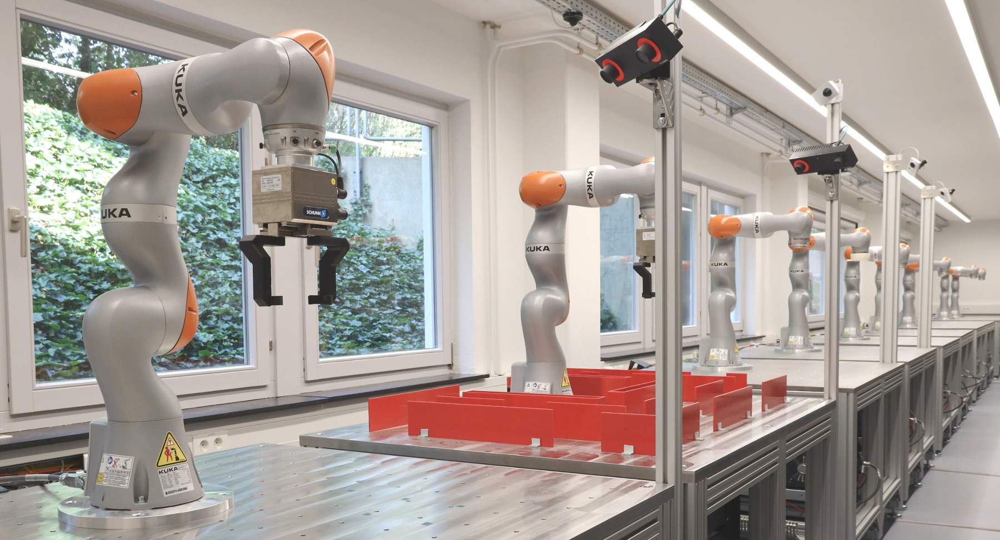

About
=====

The `KUKA Robot Learning Lab at KIT <https://rll.ipr.kit.edu/>`_ is a remotely accessible robotics lab
that is currently developed at `IAR-IPR <https://www.ipr.kit.edu/english/index.php>`_.
It allows students and researchers to access the robots in the lab
over the Internet from all over the world and to run their own projects on the robots.

The lab gives students the unique opportunity to run their code on state-of-the-art industrial robots
which are usually not available to them. In the same way, many less privileged researchers around the globe
lack access to robotic hardware due to the high costs and need to resort to simulation.
However, current simulation frameworks do not sufficiently reflect real-world behavior,
especially when manipulating objects or emulating sensors.
So for students, the lab is a unique and exciting way to learn the foundations of robotics
and to gain experience with robotic hardware.
And for researchers, the lab provides a development platform that allows them to transfer projects
from simulation to the real world.

The lab consists of ten robot cells, each equipped with a
`KUKA LBR iiwa robot <https://www.kuka.com/en-de/products/robot-systems/industrial-robots/lbr-iiwa>`_
with force/torque sensing capabilities.  Additionally, two
`Roboception stereo camera <https://roboception.com/en/rc_visard-en/>`_ as 3D sensors,
two `SCHUNK gripper <https://schunk.com/de_en/gripping-systems/series/egl/>`_, and webcams are available.
The robots, stereo cameras and grippers are graciously provided by their respective manufacturer.
The Robot Learning Lab is hosted in a new lab space that was specifically designed for it. Four rooms were
merged into one and were completely remodeled.

Besides videos from the webcams, users also get logs and data collected during experiments.
The goal is to provide the same development experience and data access as if users would sit right next to the robots.
While the aim is to give users as much freedom as possible when controlling the robots, safety will still be ensured.
With the addition of a fully automated and efficient processing pipeline for experiments,
the robots will be available almost around the clock.
This makes the lab suitable for massive open online courses (MOOCs) and Crowd Research with hundreds of participants.

The lab will be integrated into the robotics curriculum at `KIT <https://www.kit.edu/english/index.php>`_
and it will be used for exercises as part of lectures and a dedicated lab course will be set up.
In addition, IPR will partner with other universities in order to make the lab accessible to more students.

With competitions and challenging projects, the transition to Crowd Research can be accomplished.
Crowd Research has the goal to achieve new scientific breakthroughs by large-scale collaboration of researchers
from different fields and backgrounds. Assuming a large group of participants,
the likelihood is high that there are a few researchers with a great solution for the scientific problem at hand.
And others can immediately start to build upon it.

For more information, see our :doc:`publications <publications>`.
