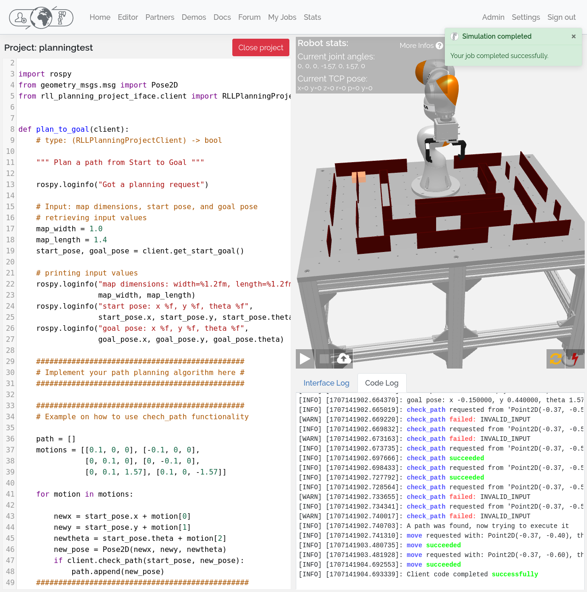
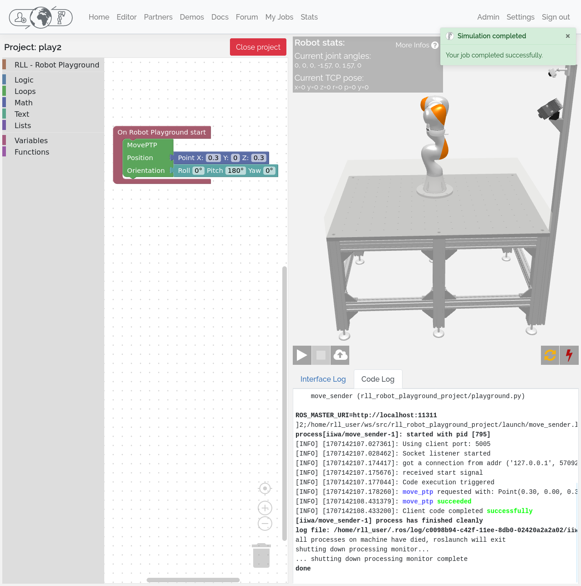

Getting started
===============

To quickly get started with the Robot Learning Lab follow the steps below.

1. Register yourself
--------------------

The first step is to register yourself. You can do this `here <https://rll.ipr.iar.kit.edu/login>`_.
We support regular user registrations using your Email address or you can log
in with a Google or Github account. If you are a student or employee at KIT,
you can directly log in with your KIT account.

2. Running demos
----------------

To get familiar with the submission processing in the lab, you can
`test some of the demos <https://rll.ipr.iar.kit.edu/demos>`_.
These are example implementations for projects that are currently hosted in the
lab or that will become available at a later point. Once you submitted one or
several demos, you can follow the processing of your jobs in the
`jobs list view <https://rll.ipr.iar.kit.edu/jobs>`_. There you can view a live feed
of the webcam while the job is running and inspect job data, including log
files once the job has finished.

The :doc:`job processing chapter <job_processing>` explains how your submission is handled by the lab system
and what the different job states mean.

3. Writing your own code
------------------------

If you successfully completed the steps above you are ready to write your own
code for the Robot Learning Lab!

We provide a fully integrated `web editor <https://rll.ipr.iar.kit.edu/editor>`_, where you can run
simulations in a virtual environment directly in your browser. You can submit your code with one click and
watch your project being executed in the lab. You only need to enter a project title and select one of the
available projects you want to work on. You can write code in Python or use a visual block-based editor,
which is intended for coding education and lets you combine coding blocks from an available list in the editor.

To get familiar with the development environment and the different ways to
control the robots in Python and C++, refer to the :doc:`project_robot_playground`, which is the
starter project that lets you move the robot around using different commands.
Or get an overview of the available movement commands first by reading the
:doc:`rll_move_client` documentation.

The :doc:`planning_project` is the more advanced project, which lets you implement a path planning algorithm
to navigate a maze with the robot.

Our `Youtube Channel <https://www.youtube.com/@kukarobotlearninglabatkit>`_ also features tutorial videos and
shows how the lab is used.

If you work with the web editor, you can ignore the setup and run commands on the project documentation pages.
You can directly start with the Python interfaces, paste and modify code in the editor, and simulate or submit
with the buttons.

If you want to work with your own development environment on your machine or code in C++, please read the next
sections. This also allows you to build more complex projects using ROS and to get familiar with ROS specifics
to build, run and submit projects.

4. Setup your own development environment
-----------------------------------------

Before you can write your own code and submit it, you need to set up your
development environment. You can either do a
:doc:`manual installation <manual_installation>` of all required packages or
start with our :doc:`ready-to-use virtual machine image <vm_setup>`.

We recommend the manual installation if you already have an Ubuntu or Debian
system on your machine or if you are interested in setting up an Ubuntu
installation by yourself. Otherwise the VM image is easier to get started
and it works on Windows and macOS.

.. hint::
   Additonally to these installation options, a web-based development environment is currently in development
   and will be offered as an alternative once it is ready.

.. _configure-api-access:

5. Configure your API access
----------------------------

To be able to submit your code to the RLL you need to retrieve the API access
token, which is used to authenticate your submission. Complete the following
steps **within** your development environment, i.e. if you are using the RLL VM
follow these steps in the VM.

1. Download your API access config from the `settings page <https://rll.ipr.iar.kit.edu/settings>`_
   and save it to the config folder of the ``rll_tools`` package in your
   workspace. This should be the full path to the file:

   .. code-block:: shell

      ~/rll_ws/src/rll_sdk/rll_tools/config/api-access.yaml

   .. note::
      The leading :code:`~` in the path refers to your users home folder, i.e. inside the VM the path resolves to: :code:`/home/rll/rll_ws/src/rll_sdk/rll_tools/config/api-access.yaml`

   You only need to do this step once. The config contains an access token that
   you can use for an arbitrary number of submissions.

2. Now you can make a submission by running:

   .. code-block:: shell

      roslaunch rll_robot_playground_project submit_project.launch

   This command will create an archive of your source code for the Robot
   Playground project and upload it to the Robot Learning Lab API. If you did
   not yet make any changes to the source code, then it will simply upload the
   default hello world program. You can then follow the job in your
   `jobs view <https://rll.ipr.iar.kit.edu/jobs>`_.

   You can execute this command anytime you want to see your current code
   version running on one of the robots in the lab.

To get started with coding, read up on the :doc:`development_workflow`.
