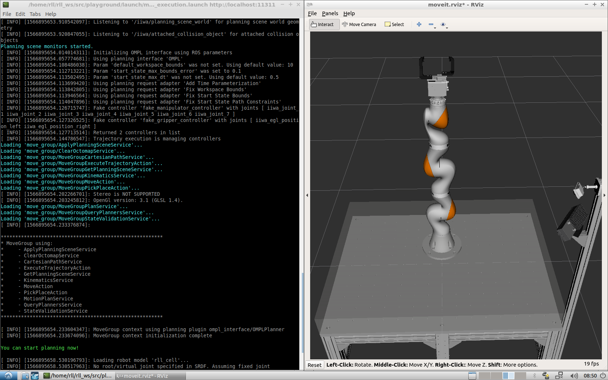

Manual installation
===================

The following instructions will help you to set up a development environment
for the Robot Learning Lab.

.. _setting-up-ros:

Setting up ROS
--------------

First you need to install the `Robot Operating System (ROS) <https://www.ros.org/>`_.
Follow the `official installation instructions <http://wiki.ros.org/ROS/Installation>`_.
You can either select `ROS Melodic Morenia <http://wiki.ros.org/melodic/Installation>`_
or `ROS Kinetic Kame <http://wiki.ros.org/kinetic/Installation>`_. Both are supported, but
ROS Melodic Morenia is recommended for a new installation.

Make sure to follow all the installation steps as described in the instructions, including
installing the dependencies for building packages.
One additional package needs to be installed as well:

.. code-block:: shell

   sudo apt install python-catkin-tools

Creating the RLL workspace
--------------------------

The following commands create a new ROS workspace in your home folder and install
the Robot Learning Lab SDK and the Robot Playground project into it:

.. code-block:: shell

   mkdir ~/rll_ws
   cd ~/rll_ws
   catkin_init_workspace
   wstool init src https://gitlab.ipr.iar.kit.edu/rll/rll_robot_playground_project/raw/master/robot_playground_project.rosinstall
   rosdep install --from-paths src --ignore-src -r -y
   catkin build
   source devel/setup.bash

The last command adds the ROS Environment variables from the RLL packages to you bash session.
If you do not want to run this command every time you open an new shell, you can add it to your
``bashrc``:

.. code-block:: shell

   echo "source ~/rll_ws/devel/setup.bash" >> ~/.bashrc

Testing the installation
------------------------

You can launch the visualization with the robot simulation to check if everything works correctly:

.. code-block:: shell

   roslaunch rll_robot_playground_project moveit_planning_execution.launch

It should look similar to the screenshot below. You should have an RViz window with the robot workcell
and the shell should print `You can start planning now!`.

