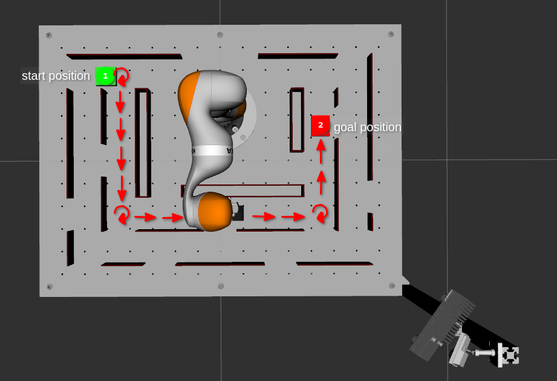
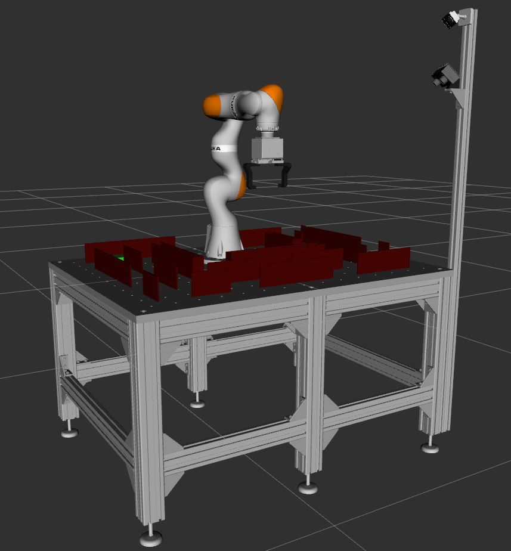

Planning Project
================

The purpose of this project is to learn how to implement path planning algorithms by navigating a
maze. Usually, path planning problems through mazes are reduced to two
dimensions. However, this project will extend the search space by a
third dimension, the orientation of the gripper around the vertical
z-axis.

An experiment will be executed as follows: 
First, the robot moves to a start position, which will be the entrance to the maze. There the
gripper will pick up an object, that is shaped like a cuboid. Then
you will be able to take over and navigate the robot through the
maze. You will have to command 2D positions and in order to get around
corners and you will have to rotate the cuboid in the corners. You will
not be able to get around corners otherwise. Once the goal is reached,
the cuboid will be placed on the table at the goal position.

A tutorial video is also available on `YouTube <https://www.youtube.com/watch?v=dkElSgGrBb4>`_.

Setup
-----

If you haven't already setup your development environment, you can do so
now: You can either do a
:doc:`manual installation <manual_installation>` of all required packages or
start with our :doc:`ready-to-use virtual machine image <vm_setup>`.

For those who have done a **manual installation**, the rll\_planning\_project can be set up with:

::

    cd ~/rll_ws
    wstool merge -t src https://raw.githubusercontent.com/kitrobotics/rll_path_planning_project/master/planning_project.rosinstall
    catkin build
    source devel/setup.bash

In the **virtual machine** you can find the rll\_planning\_project in rll_ws/src/rll_planning_project

Implementation
--------------

To find the path from start to goal you should implement a path planning algorithm that uses the robot workspace as its search space. 
Due to the shape of the maze only movements in either x- or y-direction are possible, as well as rotations to get around corners.
Discretisation of the search space is important to speed up the search. 

You can use a client (``RLLPlanningProjectClient``) that provides
three services:

.. function:: move(pose)

   Command the robot by sending a 2D pose, the robot will move on a linear path to this pose.

   :param pose: geometry_msgs/Pose2D
   :return: success (bool)
   

.. function:: check_path(pose_a, pose_b)

   Verify if a linear path between two 2D poses is valid.

   :param pose_a: geometry_msgs/Pose2D
   :param pose_b: geometry_msgs/Pose2D
   :return: valid (bool)

.. function:: get_start_goal()

   Get the start and the goal pose.

   :return: - start_pose (geometry_msgs/Pose2D)  
            - goal_pose (geometry_msgs/Pose2D)

For this experiment, a pose consists of 3 parameters: [x, y, theta]

An example template with exemplary calls to the ``move`` and
``check_path`` services can be found in ``./scripts/path_planner.py``. You can edit this file to implement 
your solution. 

An experiment will be successful if your implementation can get the robot close enough to the goal position, 
i.e. if the distance to the goal is smaller than or equal to the discretization level. 
There will also be a timeout, so if your code takes too long to run, the experiment will be aborted. 
Additionally, the experiment will be aborted as soon as a move command fails, e.g. because an invalid pose was sent.

For reference you can have a look at search algorithms like RRT or A-Star.
Below you can find some links that may help you with your
implementation:

`Robotik 1 - Grundlagen Bewegungsplanung Teil
1 (German) <https://www.youtube.com/watch?v=cZPDbkssclo>`__

`Robotik 1 - Grundlagen Bewegungsplanung Teil
2 (German) <https://www.youtube.com/watch?v=50adAkywNRI&list=PLfk0Dfh13pBMzPALOqOEPRnL9xM27eV8U&index=15>`__

`Introduction to
A\* (English) <http://theory.stanford.edu/~amitp/GameProgramming/AStarComparison.html>`__

Run the code
------------

The simulation and planning iterface can be started with:

``roslaunch rll_planning_project setup_simulation.launch``

A single planning and path execution run can be initiated with:

``roslaunch rll_planning_project run_your_planner.launch``

And finally to submit your code run:

``roslaunch rll_planning_project submit_project.launch``

The initial position and the dimensions of the grasp object can be
changed in the launch file for the planning interface
(``./launch/planning_iface.launch``).

Interface
---------

Hints
---------

**Movements**:
Due to the shape of the maze, only movements in either x- or y-direction, as well as rotations of the gripper are possible. 
To get around corners it is also possible to move linearly and rotate at the same time. 
Movements are executed by passing a pose to the ``move()`` service. Always check if the path is collision free by using the ``check_path()`` service before you execute a move!

**Discretisation**:
To speed up the search algorithm, think of a good discretisation for the search space. 
It is not efficient to check every millimeter of the grid, but at the same time, checking only every five centimeters might not yield a solution.
For rotations in the corners, it is sufficient to check 90° rotations. Keep in mind that clockwise and counterclockwise rotations are possible. 

**Heuristics**:
To choose a good next pose for your exploration, select a reasonable heuristic, such as distance to the last pose and distance to the goal pose. 

