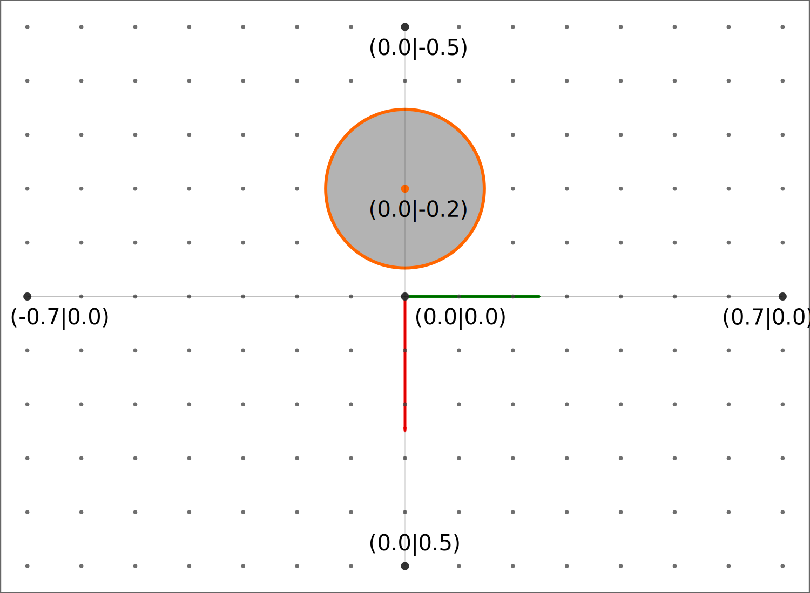

Robot Playground project
========================

The robot playground project contains Python and C++ examples to help you get
started with the Robot Learning Lab. Follow the steps below to install, build,
run and finally submit your first project!

Installation
------------

If you haven't already setup your RLL workspace with the robot playground project,
do so now by following the instructions outlined in :ref:`making-your-first-submission`.

.. _playground-build:

Build the project
-----------------

Make sure you are in your catkin workspace directory and run the following
command to build the project:

.. code-block:: bash

   catkin build rll_robot_playground_project

Afterwards load the changes in your workspace with:

.. code-block:: bash

   source ~/rll_ws/devel/setup.bash

**Note:** If you use a different workspace folder other than `rll_ws`, adjust
the path in the above command accordingly.

.. _playground-run:

Run the project
---------------

Setting up the RLL simulation environment and running your code contains two
steps. Execute each command in a **new** terminal tab or window.

1. Start the simulation environment:

   .. code-block:: bash

      roslaunch rll_robot_playground_project setup_simulation.launch

   This will open RViz showing the robot visualization and the log output
   of the `playground_iface`. You should be able to see the robot moving
   into the *home* position.

2. Execute your project code. Depending on whether you want to use Python or
   C++ run **one** of the following commands:

   - Python version (the default):

     .. code-block:: bash

        roslaunch rll_robot_playground_project run_your_code.launch

   - C++ version:

     .. code-block:: bash

        roslaunch rll_robot_playground_project run_your_code.launch use_python:=false

   The robot should now begin to move and the log output of the program
   is printed to the terminal.

To execute the project code again, interrupt the second command you executed
and simply re-run it. To interrupt the running command press :code:`Ctrl + C`
in the corresponding terminal.

.. hint:: If something goes wrong or you close a terminal by accident, it is best to close all terminals that are still open. Once all windows are closed repeat all the steps above.

Write your own code
-------------------

All example programs in the robot playground project are included twice,
one version written in Python and one in C++. The C++ code can be found in
the :code:`src/` folder whereas the Python code is located in the
:code:`scripts/` directory.

Where to put your code
^^^^^^^^^^^^^^^^^^^^^^

If you follow the steps above the code in the file
:code:`scripts/playground.py` or :code:`src/playground.cpp`, respectively,
is executed. Therefore place your own code in these files.

These files contain the same code as :code:`scripts/hello_world.py` or
:code:`src/hello_world.cpp`, respectively. This way you can initially run the
project without having to change anything.
Feel free to delete and modify the code. You can always use the hello world
file as a reference or to restore its original content.

Build your code
^^^^^^^^^^^^^^^

To build your code, once again run:

.. code-block:: bash

   catkin build rll_robot_playground_project

.. hint:: Rebuilding your project is only required if you are programming in C++.
   If you use Python, you do not need to rebuild the workspace! It is enough to simply
   restart the corresponding command as described below.

Run your code
^^^^^^^^^^^^^

You can run your own code by following the steps from *"Run the project"* as
shown above.
To run your modified code you need to restart the command from step 2. To do
this, interrupt the running command by pressing :code:`Ctrl + C` in the
terminal in which you executed the command from step 2. Once the command
has stopped simply execute the command again.

.. hint:: If you are unsure about this it is best to close all terminal windows
   and repeat the steps 1 and 2.

.. _make-c++-default:

Use C++ by default
^^^^^^^^^^^^^^^^^^

If you are programming in C++ you can and should adjust the launch files to use
C++ by default.

1. Open the file :code:`launch/move_sender.launch` and change the
   following line, while keeping the remaining lines as they are, from:

   .. code-block:: xml

      <arg name="use_python" default="true" />

   to:

   .. code-block:: xml

      <arg name="use_python" default="false" />

2. Repeat step 1 but this time modify the file
   :code:`launch/run_your_code.launch`

If you run your code now as described in :ref:`playground-run`, the file
:code:`playground.cpp` is executed by default.

.. note:: You will need to make this change if you are going to submit your
   code! On the real robot the launch file is executed without overriding
   the default.

Submit your code
^^^^^^^^^^^^^^^^

.. warning:: If you are programming in C++ you need to adjust the launch file
   as described :ref:`above <make-c++-default>` otherwise the Python
   code will be executed.

To run your code on a real robot, follow the steps described in
:ref:`making-your-first-submission`.

.. _rll-move-client:

The RLL MoveClient
------------------

The robot can be interfaced with through the `RLL MoveIface`. This interface
provides several ROS services which can be called to move the robot. To make
the interaction simpler a `MoveClient` library is provided that unifies
the process of calling the `RLL MoveIface`. This allows you to focus on
implementing your own logic instead of having to deal with ROS specifics.

.. hint:: This section introduces the available commands and how to use them.
   If you want to get started directly with a complete example jump to the
   :ref:`robot-playground-example` below. It uses all the
   concepts that are introduced in this section.

.. _move-client-getting-started:

Getting started
---------------

The following examples are provided for Python and C++. Both languages are
equally well supported and you can choose to use either. However, Python may
be a better choice for beginners.
If references to code examples are made, they refer to the Python code by
default, but it should be obvious what part of the C++ code this relates to.

.. note:: You should have completed the steps above on how to
   :ref:`build <playground-build>` and :ref:`run <playground-run>` the
   robot playground.

To get started, copy and paste the code below into the file
:code:`scripts/playground.py` or :code:`src/playground.cpp`, respectively.
This code is required to interact with the :code:`RLL MoveIface` and will serve
as a starting point for the following examples.

.. tabs::

   .. code-tab:: py

      #! /usr/bin/env python

      from math import pi

      import rospy
      from geometry_msgs.msg import Pose, Point

      from rll_move_client.client import RLLDefaultMoveClient
      from rll_move_client.util import orientation_from_rpy

      def hello_world(move_client):
          rospy.loginfo("Hello world")

          # put your code here

          return True

      def main():
          rospy.init_node('hello_world')
          client = RLLDefaultMoveClient(hello_world)
          client.spin()

      if __name__ == "__main__":
          main()

   .. code-tab:: c++

      #include <ros/ros.h>
      #include <geometry_msgs/Pose.h>

      #include <rll_move_client/move_client_default.h>
      #include <rll_move_client/util.h>

      bool helloWorld(RLLDefaultMoveClient* const move_client)
      {
        ROS_INFO("Hello world");

        // put your code here

        return true;
      }

      int main(int argc, char** argv)
      {
        ros::init(argc, argv, "hello_world");
        RLLCallbackMoveClient<RLLDefaultMoveClient> client(&helloWorld);
        client.spin();
        return 0;
      }

Internally, the `RLL MoveClient` creates a socket listener, which, once a
start signal is received, calls the specified callback function, in this case
:code:`hello_world()`.

.. note::
  The code snippets shown below need to be inserted below
  the comment :code:`# put your code here`.

.. workspace:

Robot workspace
---------------

Before you start writing your own movement code it is helpful to know which
positions the robot can actually reach.

The robot is mounted on a table, where the table defines the workspace
boundaries in the x- and y-direction. In the figure below you can see a
schematic overview of the default setup. The origin is in the middle of the
table and the robot is mounted `0.2m` behind it. The positive x-axis is
pointing to the front, the positive y-axis is oriented to the right and the
z-axis is pointing upwards.

.. _robot-workspace:

   Schematic view of the robot workspace. All dimensions are given in meters.

Depending on the current project there may be additional object fixed to the
table.

.. _move-client-move-ptp:

Point to point movement
-----------------------

The easiest way to move the robot's end effector to a user defined pose is to
call the :code:`move_ptp` service. The service requires a :code:`Pose` argument
which holds the target position and orientation.

.. tabs::

   .. code-tab:: py

      goal_pose = Pose()
      goal_pose.position = Point(.5, .2, .7)
      # rotate 90 degrees around the y axis
      goal_pose.orientation = orientation_from_rpy(0, pi / 2, 0)

      move_client.move_ptp(goal_pose)

   .. code-tab:: c++

      geometry_msgs::Pose goal_pose;
      goal_pose.position.x = .5;
      goal_pose.position.y = .2;
      goal_pose.position.z = .7;
      // rotate 90 degrees around the y axis
      orientationFromRPY(0, M_PI / 2, 0, &goal_pose.orientation);

      move_client->movePTP(goal_pose)

.. _move-client-move-joints:

Specifying joint angles
-----------------------

You can also specify the robot's joint angles directly by using the
:code:`move_joints` service. Joint angles are specified in radians and you
can either pass them as seven separate values or as a list of joint values.

.. tabs::

   .. code-tab:: py

      # specify each joint angle separately
      move_client.move_joints(0.0, 0.0, 0.0, 0.0, 0.0, 0.0, 0.0)

      # or pass a list of joint angles
      joint_values = [pi / 2, 0.0, 0.0, 0.0, 0.0, 0.0, 0.0]
      move_client.move_joints(joint_values)

   .. code-tab:: c++

      // specify each joint angle separately
      move_client->moveJoints(0, 0, 0, 0, 0, 0, 0);

      // or pass a vector of joint angles
      std::vector<double> joint_values{ M_PI / 2, 0, 0, 0, 0, 0, 0 };
      move_client->moveJoints(joint_values);

The different joints have different lower and upper joint angle limits. Setting
the joint values to zero is the initial configuration of the robot.
In the table :ref:`below<joint-limits>` you can see the lower and upper limits
specified in radians.

.. _joint-limits:

.. table:: The lower and upper joint angle limits specified in radians as multiples of π.

   =========  ===========  ===========
   Joint #    Lower limit  Upper limit
   =========  ===========  ===========
   1          -0.938 π     0.938 π
   2          -0.661 π     0.661 π
   3          -0.938 π     0.938 π
   4          -0.661 π     0.661 π
   5          -0.938 π     0.938 π
   6          -0.661 π     0.661 π
   7          -0.966 π     0.966 π
   =========  ===========  ===========

.. hint:: These are the maximum joint angles, the actual limits you
   can reach are a bit lower.

.. _move-client-move-lin:

Linear movement
---------------

If you want to move the end effector on a linear trajectory, starting at
the current pose, call the :code:`move_lin` service.

.. tabs::

   .. code-tab:: py

      goal_pose = Pose()
      # set position and orientation of the pose...

      move_client.move_lin(goal_pose)

   .. code-tab:: c++

      geometry_msgs::Pose goal_pose;
      // set position and orientation of the pose...

      move_client->moveLin(goal_pose);

.. hint::
  A linear movement is more constrained than a PTP movement and may fail where
  a PTP movement succeeds.

.. _move-client-move-random:

Random movement
---------------

You can move the robot into a random position by calling the
:code:`move_random` service. This is a good start if you just want to see
the robot move.

.. tabs::

   .. code-tab:: py

      move_client.move_random()

   .. code-tab:: c++

      move_client->moveRandom();

If you want to know where the robot has moved to, you can retrieve the
chosen random pose:

.. tabs::

   .. code-tab:: py

      # returns the chosen random pose
      pose = move_client.move_random()

   .. code-tab:: c++

      geometry_msgs::Pose pose;
      # store the pose in the pointed to Pose object
      move_client->moveRandom(&pose);

.. _move-client-error-handling:

Error handling
--------------

There are various reasons why a service call might fail:

- by passing invalid values e.g. joint angles outside the allowed range
- requesting a linear motion to a goal pose, but the robot cannot move
  to this goal pose on a straight line.
- some other unforeseen reason

You will not know in advance if your movement request is successful.
Therefore, it is important to validate the success of a service call.

.. hint::
   If something went wrong and you want to know why, consult the output log. The `Rll MoveClient`
   by default is rather verbose and provides a detailed output of the requests made and
   responses received.

.. tabs::

   .. code-tab:: py

      response = move_client.move_random()
      if not response:
         rospy.loginfo("Service call failed!")

   .. code-tab:: c++

      geometry_msgs::Pose pose;
      bool success = move_client->moveRandom(&pose);
      if (!success){
         ROS_INFO("Service call failed!");
      }

The return values of services calls indicate the success of an invocation. Here
the Python and C++ version differ slightly. Some services calls in Python may
provide a return value other than a boolean. E.g. :code:`move_random` returns
a :code:`Pose` on success or :code:`None` on failure instead.
However due to the `truthy/falsy` behavior of the return values, you can
still test them the same way as if they were boolean values.

Service calls and exceptions
^^^^^^^^^^^^^^^^^^^^^^^^^^^^

If a critical error is reported by the `RLL MoveIface`, the `RLL MoveClient`
throws an exception and aborts your code. This is done because if something
fails in a critical manner, the `RLL MoveIface` aborts all operations, and will
no longer accept new movement requests.

However, this is only the case for critical failures, e.g. the robot detects
a deviation from its expected position. For non-critical failures, such as
trying to move to an unreachable pose, no exception is raised and only the
result of the service call indicates a failure.

If you want to throw an exception on any failure, critical or not, you can
configure the `RLL MoveClient` to do so.

.. tabs::

   .. code-tab:: py

      # raise an exception on any service call failure regardless of severity
      move_client.set_exception_on_any_failure(True)

   .. code-tab:: c++

      // raise an exception on any service call failure regardless of severity
      move_client->setExceptionOnAnyFailure(true);

This is particularly useful if you do not want to concern yourself with error
checks. E.g. your application is *all or nothing*, meaning if any service call
fails, abort the whole program.

.. _robot-playground-example:

Hello World Example
-------------------

To demonstrate how to use all the movement methods described in
:ref:`rll-move-client` we will build a full example that utilizes all of them.
The code is extended step by step as more methods are added.
The examples are snippets of the whole program and each example should run on
its own. For each step, the relevant new lines are highlighted.

.. note::
  The example created below is the `hello world` program from the
  `Robot Playground Project <https://gitlab.ipr.kit.edu/rll/rll_robot_playground_project/>`_.

  It is recommended that you follow along and copy the changes as they are added
  into the file :code:`scripts/playground.py` or :code:`src/playground.cpp`, respectively.
  This way you can recreate the example for yourself, run the code after every
  change and get a better understanding of what is happening.

Hello ROS
^^^^^^^^^

.. tabs::

   .. group-tab:: Python

      .. literalinclude:: _static/code_examples/hello_world.py
         :linenos:
         :emphasize-lines: 16,17
         :lines: 1, 20-35, 175-186

   .. group-tab:: C++

      .. literalinclude:: _static/code_examples/hello_world.cpp
         :language: cpp
         :linenos:
         :emphasize-lines: 9,10
         :lines: 20-29, 187-198

We use the :ref:`move-client-getting-started` template from above and
add some simple logging output. As the comments indicate, you should use the
logging methods provided by ROS, instead of the system default output.

It's moving!
^^^^^^^^^^^^

The previous example didn't actually move the robot. Lets change that!

.. tabs::

   .. group-tab:: Python

      .. literalinclude:: _static/code_examples/hello_world.py
         :linenos:
         :emphasize-lines: 17
         :lines: 1, 20-33, 37-42, 175-186

   .. group-tab:: C++

      .. literalinclude:: _static/code_examples/hello_world.cpp
         :linenos:
         :language: cpp
         :emphasize-lines: 10
         :lines: 20-27, 31-36, 187-198

We use the :ref:`move_random <move-client-move-random>` function to move the
robot into a random position. Adding a delay between movements helps to see
the different movements better.

Specifying joint angles
^^^^^^^^^^^^^^^^^^^^^^^

The next example illustrates how to add error checks, which we previously
neglected.

.. tabs::

   .. group-tab:: Python

      .. literalinclude:: _static/code_examples/hello_world.py
         :linenos:
         :emphasize-lines: 19, 25, 32-33, 41-42, 44-45
         :lines: 1, 20-33, 44-75, 175-186

   .. group-tab:: C++

      .. literalinclude:: _static/code_examples/hello_world.cpp
         :linenos:
         :language: cpp
         :emphasize-lines: 12, 20, 24-27, 34, 36-39
         :lines: 20-27, 38-70, 188-199

We use the :ref:`move_joints<move-client-move-joints>` function to specify
the seven joint positions. As stated in :ref:`move-client-error-handling`,
service calls return :code:`False` on failure. In this example the second call
:code:`move_client.move_joints(0.0, 0.0, 0.0, pi / 2, 0.0, 0.0, 0.0)` would
move the robot outside the allowed workspace. As a result the call fails and no
movement is made. Without the error check you might not have noticed that
the call failed!

.. hint::
   If you check the output log you will notice that the failure has been reported there,
   too. Service call failures will always be logged, regardless of your own error checks.

More movement
^^^^^^^^^^^^^

.. tabs::

   .. group-tab:: Python

      .. literalinclude:: _static/code_examples/hello_world.py
         :linenos:
         :emphasize-lines: 18-20, 23, 38, 40, 45, 47
         :lines: 1, 20-33, 77-110, 175-186

   .. group-tab:: C++

      .. literalinclude:: _static/code_examples/hello_world.cpp
         :linenos:
         :language: cpp
         :emphasize-lines: 13-17, 20, 36, 40, 45, 47
         :lines: 20-27, 48, 71-110, 188-199

Point based movement ist easier to understand. You only need to specify
the position and orientation of the end effector and the robot will move there.
However, you cannot control how the robot gets to this position.

The orientation part of a pose is stored as a quaternion. You usually don't set
the quaternion manually. Use the provided helper functions to generate the
quaternion for you.

Linear movement
^^^^^^^^^^^^^^^

.. tabs::

   .. group-tab:: Python

      .. literalinclude:: _static/code_examples/hello_world.py
         :linenos:
         :emphasize-lines: 22, 25, 28, 33, 37, 42, 44, 47-48, 50
         :lines: 1, 20-33, 79, 112-147, 175-186

   .. group-tab:: C++

      .. literalinclude:: _static/code_examples/hello_world.cpp
         :linenos:
         :language: cpp
         :emphasize-lines: 15, 18-20, 23, 28, 32, 37, 40,45-46, 49
         :lines: 20-27, 74, 112-153, 188-199

Previously we moved in a point to point fashion to a desired pose.
However, this has the drawback that we cannot guarantee how the end effector
is reaching its new position. One alternative is to use
:ref:`move-client-move-lin` instead. This ensures that the end effector is
moved on a linear trajectory to its target position. In the example above,
three consecutive linear movements, forming a triangular path, are executed.

.. tabs::

   .. group-tab:: Python

      .. literalinclude:: _static/code_examples/hello_world.py
         :linenos:
         :emphasize-lines: 25, 32, 27, 34
         :lines: 1, 20-33, 79, 117, 120, 148-166, 175-186

   .. group-tab:: C++

      .. literalinclude:: _static/code_examples/hello_world.cpp
         :linenos:
         :language: cpp
         :emphasize-lines: 22, 31, 24, 33
         :lines: 20-27, 48, 74, 117, 120-122, 154-177, 188-199

Since :code:`move_lin()` requires the end effector to travel on a
linear trajectory, it is more constrained than :code:`move_ptp()`
which imposes no restrictions on how to reach the goal pose.
It is therefore possible that :code:`move_lin()` fails where a movement with
:code:`move_ptp()` succeeds, as illustrated in the example above.

.. _robot-playground-complete:

Complete example
^^^^^^^^^^^^^^^^

The complete code, which encompasses the examples above, is shown below:

.. tabs::

   .. group-tab:: Python

      .. literalinclude:: _static/code_examples/hello_world.py
         :linenos:
         :caption: Complete hello_world.py example
         :lines: 1, 20-

   .. group-tab:: C++

      .. literalinclude:: _static/code_examples/hello_world.cpp
         :linenos:
         :language: cpp
         :caption: Complete hello_world.cpp example
         :lines: 20-
