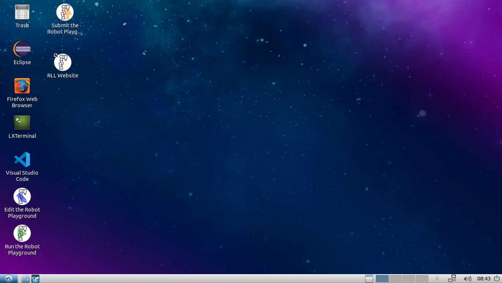

RLL virtual machine
===================

If you don't want to install the RLL environment manually you can use the
provided VirtualBox VM. The VM contains a preconfigured development environment
and is based on Lubuntu 18.04 with ROS Melodic Morenia.

Installation
--------------

If you do not have VirtualBox already installed, download and install
`VirtualBox <https://www.virtualbox.org/>`_ first.
If you encounter problems installing VirtualBox or want to read up on the
configuration options available consult the
`Virtual Box Manual <https://www.virtualbox.org/manual/>`_.

.. note:: On some machines hardware virtualization is deactivated by default.
   In this case you need to enable the corresponding option in your computer's
   BIOS. Depending on your system this will likely be called *Intel
   Virtualization Technology* or *AMD-V virtualization*.

The RLL VM requires about 15 GB of storage space and you should use a recent
computer since running the simulation inside the VM can be quite resource
intensive.

Setup the RLL VM Image
^^^^^^^^^^^^^^^^^^^^^^

1. Download the RLL Virtual Machine (VM) packaged as an `.ova` file
   `here <https://rll-dl.ipr.iar.kit.edu/vm/rll-vm-lubuntu-18.04.ova>`_.

2. Start VirtualBox and import the downloaded `.ova` file by choosing:
   `File->Import Appliance` from the menu.

3. Select the downloaded `.ova` file and adjust the machine settings if
   required. The defaults should be fine and can be adjusted later.

4. Click `Import`, this will take a while.

5. Open the VM settings, go to the `Display Settings` and make sure that the
   VM has enough `Video Memory` available, i.e. set it to the maximum value of
   `128MB`. You should also tick the `Enable 3D Acceleration` checkbox. If you
   later notice that the VM crashes or has display issues un-tick the checkbox.

6. If you have completed these steps the VM is setup and can be powered on.

.. note:: You **cannot** change the virtual machine's  settings while the VM instance is running.
          If you want to change the settings you need to first power if off.

Using the VM
------------

The VM contains a fully functional OS based on Lubuntu 18.04,
that is Ubuntu 18.04 with the LXDE desktop environment.

You can find all installed programs via the application menu in the bottom
left of your VM desktop. You can launch the file explorer and web browser
by clicking the icons next to it. You will often need to start a Terminal.
The easiest way to do so is to use the keyboard shortcut `Ctrl + Alt + T`
while you are within the VM window.

To power off the VM you can click on the icon in the bottom right and select
`Shutdown` in the dialog that will appear.
Alternatively you can shutdown the VM by closing the VirtualBox window and
selecting `Power off the machine` in the dialog.

    The VM desktop with the application menu in the bottom left
    and shortcuts on desktop to edit, run and submit the robot playground project.

.. note:: The default username and password are both: **rll**

.. note:: The VM is configured to use a German keyboard layout by default.

ROS workspace
^^^^^^^^^^^^^

The VM contains an already initialized catkin workspace in the :code:`~/rll_ws`
folder within the user's home directory.
The :doc:`Robot Playground project<project_robot_playground>` is set up and
ready to run. Additionally, the VM comes with some handy desktop shortcuts to
make launching and editing the robot playground project more convenient.

.. hint:: On Linux based systems, paths beginning with a leading :code:`~`
   refer to the user's home folder. The full path to the catkin workspace is
   therefore :code:`/home/rll/rll_ws`.

RLL desktop shortcuts
^^^^^^^^^^^^^^^^^^^^^

You can use the provided desktop shortcuts to build, edit and submit the
robot playground project instead of running the commands manually as described
in the :doc:`documentation <project_robot_playground>`.
The shortcuts are convenient but your development workflow will probably be
faster if you execute the commands in a terminal. These desktop shortcuts are
available:

1. **Start the Robot Playground** This will build the project, start the
   simulation and run your code as described in :ref:`playground-run`.

   .. note:: This will open a Tilix terminal displaying the log output and
      a Rviz window showing the robot visualization.

2. **Edit the Robot Playground** Launches the VS Code editor with the source
   code of the robot playground already opened.

3 **Submit the Robot Playground** uploads your code to be run on a real robot.

  .. note:: In order for this to work, you need to setup your API access token
     first as described in :ref:`configure-api-access`

4. **RLL Website** opens Firefox and loads the RLL website. From here you can
   go to the documentation by clicking the corresponding menu item. If you want
   to download your API access token, click on
   `Settings -> Download API access config`.

Editing files
^^^^^^^^^^^^^

The VM comes with `VS Code <https://code.visualstudio.com/>`_
and `Eclipse <https://www.eclipse.org/>`_ installed.
VS Code is used as the default editor in the tutorial and is preconfigured
with some useful settings.

.. hint:: You can, of course, use any other text editor of your choice.
          `Gedit`, for example, is an alternative lightweight text editor.

Debugging your Code with VS Code
^^^^^^^^^^^^^^^^^^^^^^^^^^^^^^^^

A :code:`launch.json` config is provided so you can debug your code right away.
For more information on debugging consult the `VS Code documentation <https://code.visualstudio.com/docs/editor/debugging>`_. To start the project with the VS Code debugger execute the following steps:

1. **Start the simulation environment**: Either run
   :code:`roslaunch rll_robot_playground_project setup_simulation.launch` in a
   terminal or use the provided VS Code task. The task can be executed by
   opening the command pallette (`Ctrl+Shift+P`) typing `Run Task` and
   choose `RLL: Setup playground simulation`.

2. Choose either one of the following options:

   1. **Launch your Python code**: Open the :code:`playground.py` file in the
      editor and place breakpoints if you wish. Go to the debug perspective
      (`Ctrl + Shift + D`). Make sure to select the configuration
      `Python: Debug playground.py` and start debugging.

   2. **Launch your C++ code**: Open the :code:`playground.cpp` file in the
      editor and place breakpoints if you wish. Go to the debug perspective
      (`Ctrl + Shift + D`). Make sure to select the configuration
      `C++: Debug playground.cpp` and start debugging. Don't forget to build
      your code first, e.g. by running the `RLL: Build C++ Code` task.

3. **Trigger the project execution**: Run
   :code:`roslaunch rll_tools run_project.launch` in a terminal or use the
   provided VS Code task `RLL: Trigger project execution`.

.. hint::
   If you run the project code directly e.g. in a terminal or other IDE you need to
   set the environment variable :code:`ROS_NAMESPACE=iiwa` before you launch your
   code. The VS Code :code:`launch.json` configuration already does this for you.
